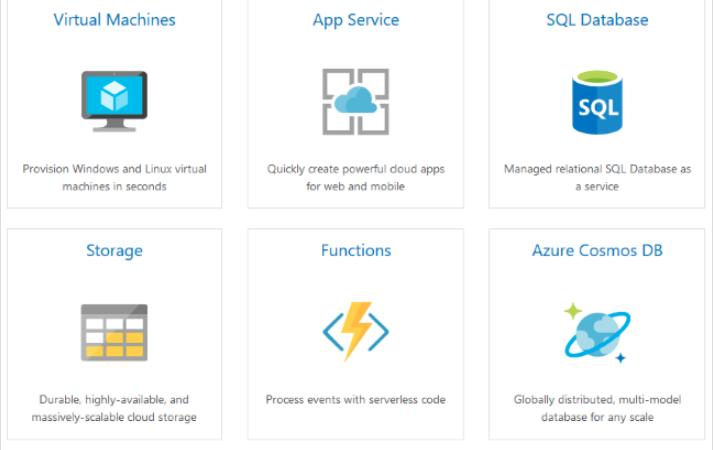
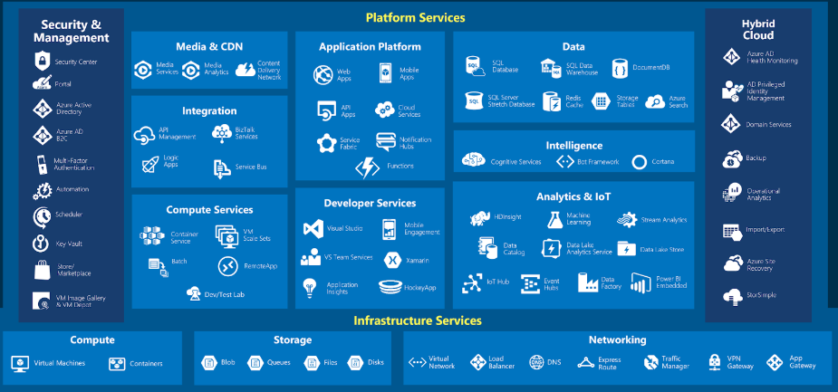
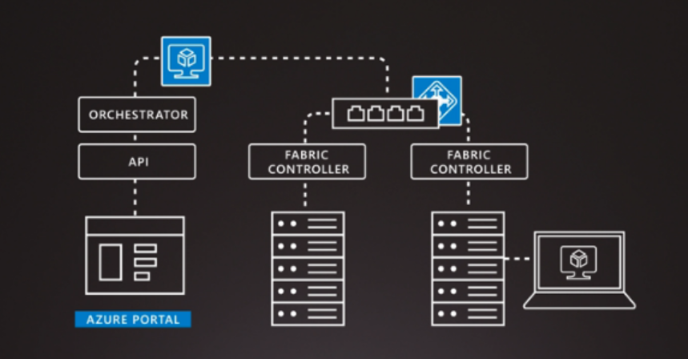
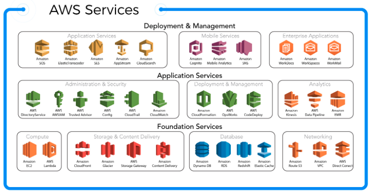
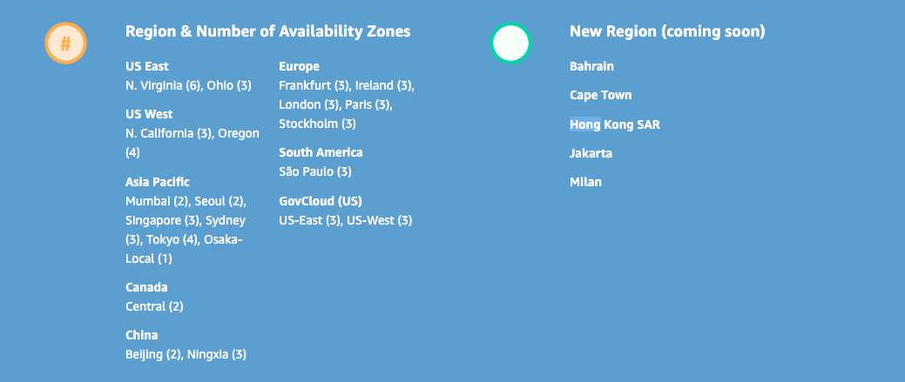
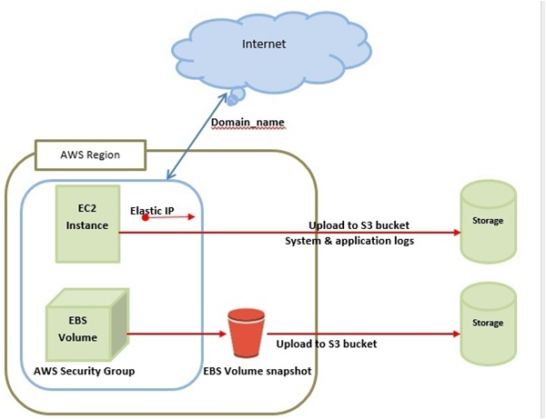
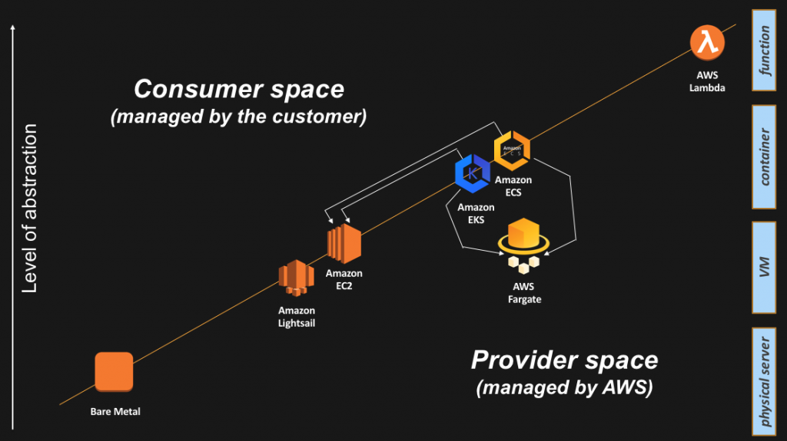

# Amazon AWS vs Microsoft Azure
By: Buse Özer and Sara Díaz 

 Nowadays the need of online resources in the cloud has become crucial for companies throughout different industries. These offer the advantage of being scalable and dynamical to arising and on-demand needs without having huge impact on the cost. Although many platforms have risen to offer these services, Microsoft Azure and Amazon AWS are among the main key players. But what differentiates them? Is one better than the other? When should a company use one or the other? This research project looks to answer this questions by first understanding each of them and then comparing their main features.

## Microsoft Azure

 Azure is a private and public cloud platform that offers a set of services all developed by Microsoft Inc. since 2010. This services help IT specialist to build, deploy and manage applications. For more detailed information, they provide a detailed documentation in their <a href="https://azure.microsoft.com/en-gb/overview/what-is-azure/">website</a>. 

### Services

Its most popular services include: 

Figure 1: Azure most popular services

 

 By 2019, Azure counts with 54 regions to host its operations, more than any other cloud provider. Database products like SQL Azure DB are present in 46 of this locations (85% of the total). This gives clients the opportunity to choose a desired location according to their needs of response and latency times, as well as IT knowledge in the region, risk of natural disaster occurrence, etc. 
 
 

Figure 2: Azure's regions

In general it divides its services in into two main groups - infrastructure and Platform Services: 

Figure 3: Azure's services catalogue

The platform services are also supported by Security and Management services as well as a they can be deployed on hybrid cloud services (public and private clouds).

### Architecture

 This section explains the basis of Azure’s architecture. Azure uses a technology called Virtualization which separates the coupling between a computer’s hardware and operating system by using a layer named a Hypervisor, which emulates a computer’s functions and CPU within virtual machines. These virtual machines can run both Windows and Linux operating systems and optimize the abstracted hardware. 

Figure 4: Azure's basic architecture. To better understand these concept, Azure provides the following <a href="https://www.microsoft.com/en-us/videoplayer/embed/RE2ixGo">video</a>

 Each of its data centers distributed around the world contains many racks which containing servers and each of this implements this Hypervisor technology to run multiple virtual machines. A network switch provides connectivity between the servers.  create it within the servers. After this the user can access it and all its functions. Each server within the rack runs a special piece of software called the Fabric Controller, which, at the same time, is connected to another software called the Orchestrator which manages every activity in Azure included, but not limited, to user requests. These request are created by using the web API, which is more popularly accedes through the Azure Portal (there are other ways to access it). The request is packaged and sent to the Fabric Controller. 

 On a higher level, the architecture depends on the clients needs. Azure has made available  <a href="https://docs.microsoft.com/en-us/azure/architecture/reference-architectures/architectures">reference architectures</a>  to guide users. 

## Amazon Web Services (AWS)

  Amazon Web Services (AWS) is a cloud service platform, which provides services in different domains such as compute, storage, delivery and other functionality which help business to scale and grow. For more detailed information, they provide a detailed documentation in their <a href="https://aws.amazon.com/what-is-aws/">website</a>. 

### Services
 

 AWS allows users to use different variety of services to create and deploy applications in the cloud platform. These services are designed in such a way that they work with each other and produce a scalable and efficient outcome. AWS was launched in 2006 and has been one of the key players in the industry. Like other cloud platforms offer various advantages such as management overhead reduction, cost minimization etc. Within its main services are: 

Figure 5: AWS Services

 AWS spans 61 Availability Zones within 20 geographic regions around the world, with announced plans for 15 more Availability Zones and five more Regions (Bahrain, Cape Town, Hong Kong SAR, Jakarta, and Milan): 

Figure 6: AWS Regions

### Architecture 

AWS bases its architecture on the following components, being one of the main ones the EC2 (Elastic Compute Cloud) which is the starting point for virtualization: 

Figure 7: AWS basic architecture

This can also be seen given different levels of abstraction: 

Figure 8: AWS basic architecture by levels of abstraction and customer involvement. For the complete explanation of the diagram above, the following <a href="https://aws.amazon.com/blogs/architecture/compute-abstractions-on-aws-a-visual-story/">link</a> is provided by AWS documentation

As seen, below EC2 there might be a EC2 bare metal instances that allow customers direct access to hardware. As said in the <a href="https://aws.amazon.com/blogs/architecture/compute-abstractions-on-aws-a-visual-story/">AWS website documentation</a>:

> 
“…. (AWS customers) wanted access to the physical resources for applications that take advantage of low-level hardware features such as performance counters and Intel® VT that are not always available or fully supported in virtualized environments, and also for applications intended to run directly on the hardware or licensed and supported for use in non-virtualized environments.”
 

 It's important to know that this can be changed. Due to the different needs of its millions of customers, AWS requires a certain degree of flexibility in the services offered because there are many different patterns, use cases, and requirements to satisfy. Due to that many architecture layouts might be created. This is why it offers documentation on reference architecures in it's called <a href="https://aws.amazon.com/architecture/?awsf.quickstart-architecture-page-filter=highlight%23new">Architecture Center</a>; offering different arragements depending on the defined requirements.

## Comparison Summary 

Given the research done, the following comparison summary table was made: 

Attribute | Comparison
--------| ----
**Trajectory** | AWS is the pioneer being launched in 2006 (4 years prior to Azure)
**Availability Zones** | 
Azure has 54 regions in 140 countries, more than any other cloud provider including AWS, which has 20 in 61 countries. 

**User-friendliness** | 
The general consensus is that Azure is more user-friendly and easy-to-follow for crowds without technical background than AWS. Following this, AWS is said to be more developer-friendly. 

**Clients** | 
Both companies cater to a high amount of companies (many which are reported in Forbes 500), however AWS maintains the lead as the pioneer while Azure bases its client capture on their existing relation to Microsoft products. 

**Compliance** | 
Both of them have comparable amounts of compliant offerings, having the same level of security and data protection. 

**Hybrid Cloud Capabilities** | 
Both of them have comparable amounts of compliant offerings, having the same level of security and data protection. 

**Market** | 
AWS has 32% of the whole cloud market while Azure stands with 16% by the end of 2018. However, Azure grew the most out of the more with a figure of +76% vs +46.3% from AWS 

**Pricing** |  
Both have driven down their prices and continue to use their scale to achieve low costs. Azure shows to offer better discount rates for long term contracts (1-3 years). It also offers the enterprise subscription, to cater to specific needs of this client segment by offering discounts for software licenses and services

**Compute (IaaS, Containers, PaaS, Serverless, Scalability)** |  
 Comparable services with minor differences in all these services.   AWS has EC2 (IaaS), ECS & EKS (Container management), Elastic Beanstalk(Paas), Lambda (Serverless) and AWS Auto Scaling.   Azure has VM (IaaS), Azure Container Service & AKS (Containers), App Service (PaaS), Functions (Serverless), and AutoScaling.  

**Storage** |  
 Comparable services with AWS having the lead in terms of documentation ( including free webinars, tons of sample code and libraries, etc.) for Simple Storage Service (S3), its main storage service.   While AWS offers Simple Storage Service (S3), Azure’s main service is Blob Storage based in block storage.  

**Network** |  
Comparable services with AWS in cloud virtual networking, Cross-premises connectivity, load balancing, etc. 

**Database** |  
Both AWS and Azure support relational and NoSQL databases.

**Big Data and Analytics Platforms** |  
 Both providers offer similar building blocks; data processing, data orchestration, streaming analytics, machine learning and visualisations.   Azure is believed to be strongest in visualization as it has more trajectory specifically with PowerBI.   Also, Azure is very strong in the machine learning space, offering pre-trained models and is the only provider to offer the capability for organisations to track and document their data assets.  

To get a more detailed analysis at each of the components, the following resources are available to consult:

## Components
- [Market](https://github.com/sdiazben/Research-topic/blob/master/documents/Market.md) 
- [Compute](#Compute)   
<a name="headers"/>

## Conclusions

## References
  
 
